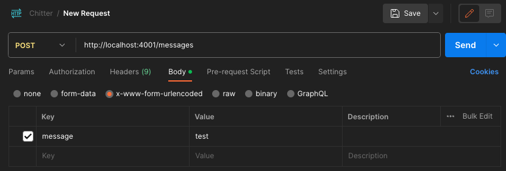

# Chitter
Demo app for interfacing with custom GPTs

# Steps
- `npx express-generator` ([Source](https://expressjs.com/en/starter/generator.html))
- `tsc --init`
- `npm i express`
- `npm i --save-dev @types/express`
- `npm run dev`

